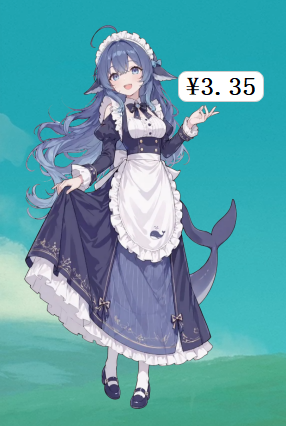
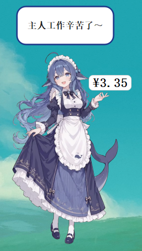
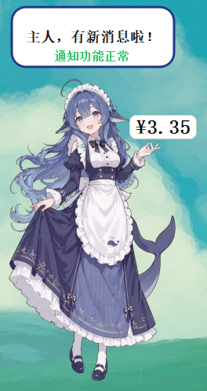
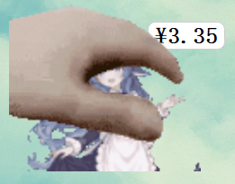

# desktop-pet — Desktop Pet Core

> **Language:** English | [简体中文](README.md)

A desktop pet core built on PyQt5: transparent and always-on-top, draggable, with thought-cloud notifications, real-time DeepSeek Open Platform balance display, peak/idle period reminders, and appearance customization.

## Features

1. **Thought-cloud notifications**: when an action triggers, a cloud bubble pops up above the pet with centered text;
   white fill and dark blue outline by default, with both color and text customizable (the color picker includes an
   eyedropper and hex color code input).
2. **Multi-platform real-time balance display**: polls platform balances for bound accounts (DeepSeek,
   Kimi/Moonshot, and SiliconFlow built in; the adapter architecture is extensible); a green floating-text
   animation on balance increases and a red one on decreases; the right-click menu toggles the persistent
   balance display;
   accounts are managed as "platform + API Key" pairs, with support for binding multiple accounts and jumping to each platform's official site.
3. **Peak/idle period switch notifications**: a special notification pops up when switching between peak hours
   (Beijing time, Monday to Friday 9:00-12:00 and 14:00-18:00) and idle periods; **it only disappears when you click
   the "Got it" button** (clicking other areas of the bubble will not close it); while a special notification is
   displayed, other notifications such as self-talk and head-pat quotes are
   suppressed until it is acknowledged.
4. **Appearance customization**: PNG/GIF files can be imported to change the pet's look; the default image is
   `assets/deepseek拟人.png`.
5. **Scroll-wheel zoom**: with the mouse hovering over the pet, scrolling the wheel zooms the image or GIF in/out (the scale is remembered automatically).
6. **Left-click interaction**: **pressing and holding** the pet immediately loops the "head pat" animation and restores it on release;
   a single click no longer triggers anything; if a still image is configured, it is shown while held; the default asset is `assets/ds摸头.gif`,
   replaceable in settings.
7. **Head-pat quotes**: **long-pressing** the pet (0.6 seconds by default) pops up a random head-pat quote; while held, quotes
   keep rotating at the configured interval; head-pat quotes and self-talk are two independent quote libraries that do not interfere with each other.
8. **Self-talk**: while idle, cloud notifications pop up at random intervals from a customizable text library,
   as if the pet were talking to itself; the text library, toggle, and interval are all adjustable in settings.
9. **JSON-based quote libraries**: head-pat and self-talk quotes are now stored in separate JSON files
   (`pet_head_quotes.json` / `self_talk_quotes.json`); preset default libraries are generated automatically on first run;
   the legacy `self_talk.txt` is migrated to JSON automatically (the original file is kept).
10. **Always-on-top toggle**: a single "show on top" setting controls all windows uniformly; notifications, the pet,
    the balance text, and floating text switch together, so you never get "notifications on top but balance text not on top".
11. **Polished balance display**: the persistent balance text sits at the upper right of the image, black text on white, with an adjustable font size.
12. **Hot-applying settings**: any setting change (accounts, appearance, notifications, self-talk, always-on-top, refresh interval, etc.) takes effect immediately,
    no restart needed.
13. **Basic interaction**: drag the pet with the left button; the position is remembered automatically; right-click opens the menu.
14. **Launch at startup**: the right-click menu toggles "launch at startup" (writes to the current user's Run key, no administrator needed;
    starts silently via pythonw at boot).

## Screenshots

| Default look | Self-talk notification |
| --- | --- |
|  |  |

| Notification and green floating animation | Head-pat interaction |
| --- | --- |
|  |  |

## Download

The latest version can be downloaded from the [Releases](https://github.com/toki-2004/desktop-pet/releases) page.

## Requirements

- Windows 10/11
- Python 3.9+ (verified with Python 3.13 on the development machine)
- Dependencies: PyQt5, requests (see `requirements.txt`)

## Install and Run

```bash
pip install -r requirements.txt
python main.py
```

## Usage

- **Left-drag**: move the pet (saved automatically).
- **Scroll zoom**: scroll the wheel while the cursor is over the pet to zoom in (up) / out (down).
- **Left-button hold**: plays the interaction animation (head pat) immediately, looping until release; a single click does not trigger it.
- **Left-button long-press** (0.6 seconds by default): additionally pops up head-pat quotes; while held, quotes rotate at the configured interval.
- **Right-click menu**:
  - Persistent balance display: toggle the always-visible balance text;
  - Launch at startup: toggle starting with the system;
  - Bind/manage accounts: add or delete DeepSeek accounts;
  - Notification settings: customize notification text, peak/idle texts, and the cloud fill and outline colors;
  - Change appearance: import PNG/GIF, always-on-top toggle, head-pat quote library editor;
  - Send test notification: verify the cloud bubble and floating animation;
  - Quit.

## Configuration

The configuration file is `config.json` in the project root (generated automatically, already added to `.gitignore`):

- `balloon_fill` / `balloon_outline`: cloud fill and outline colors (hex);
- `balloon_text`: default notification text;
- `peak_balloon_text` / `idle_balloon_text`: texts shown when the peak/idle period begins;
- `pet_image`: pet image path (PNG/GIF);
- `pet_scale`: zoom scale (adjusted with the wheel, saved automatically);
- `pet_interact_image`: left-click interaction image/GIF path (PNG/GIF);
- `pet_pos`: pet position;
- `show_balance`: persistent balance display toggle;
- `balance_font_size`: balance font size (9-24);
- `poll_interval_sec`: balance polling interval in seconds (default 3, adjustable in the settings panel, minimum 1);
- `always_on_top`: always-on-top toggle (synced across notifications / pet / balance text / floating text);
- `self_talk_enabled` / `self_talk_texts` / `self_talk_interval` / `self_talk_file`:
  self-talk toggle, default texts, interval (seconds), and quote library JSON file path;
- `pet_head_enabled` / `pet_head_texts` / `pet_head_interval` / `pet_head_long_press_ms` /
  `pet_head_file`: head-pat quote toggle, default texts, quote rotation interval while held (seconds), long-press threshold (milliseconds),
  and quote library JSON file path;
- `auto_start`: launch-at-startup toggle (kept in sync with the registry Run key);
- `accounts`: account name → `{"platform": "<platform id>", "api_key": "..."}`;
  the legacy format (storing the Key string directly) is migrated automatically to DeepSeek accounts.

## Binding Accounts

1. Right-click menu → Bind/manage accounts → Add account;
2. Choose a platform (DeepSeek / Kimi / SiliconFlow) and click "Open the platform's official site in browser" to get an API Key;
3. Enter the account name and API Key; balance polling starts as soon as you save.

Currently supported balance endpoints:

- DeepSeek: `GET https://api.deepseek.com/user/balance` (verified);
- Kimi (Moonshot): `GET https://api.moonshot.cn/v1/users/me/balance` (implemented per the official documentation);
- SiliconFlow: `GET https://api.siliconflow.cn/v1/user/info` (implemented per the official documentation).

Other platforms can be added in `platforms.py` using the same interface (`fetch(api_key) -> (balance, currency)`).

## Peak Hours Definition

Peak hours are Beijing time, Monday to Friday 9:00-12:00 and 14:00-18:00; all other times are idle periods.
On a period switch, a notification pops up and stays visible until you click "Got it" or confirm the bubble.

## Packaging (Optional)

For distributing to end users, package with PyInstaller:

```bash
pip install pyinstaller
pyinstaller --noconsole --onefile --name DesktopPet --add-data "assets;assets" main.py
```

Packaging notes: `config.json` is not packaged (it contains API Keys) and is generated automatically in the exe's directory on first run;
the bundled assets and the two default quote libraries (`assets/*_quotes.json`) are extracted from the package directory and can be customized.

## Security Note

The DeepSeek API Key stored in `config.json` is in plain text. Do not commit that file to any repository or
share it; consider creating a dedicated Key for the pet and setting a quota on the platform side.
