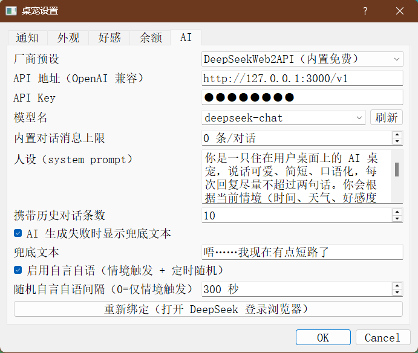

# desktop-pet-ai · 免费 AI 桌宠

> **语言：** 中文 | [English](README.en.md)

一只住在你桌面上的 AI 桌宠：会自言自语、回应摸头、陪你聊天，所有文本由 AI 实时生成。
**内置免费 AI（DeepSeekWeb2API）**——首次用网页版 DeepSeek 账号登录一次后即可零成本聊天，
不需要任何 API Key。

## 核心优势

- **完全免费**：内置 DeepSeekWeb2API 本地服务，首次登录网页版 DeepSeek 账号一次，
  之后无需任何付费 API Key，长期零成本使用。
- **AI 实时生成一切文本**：自言自语、摸头反应、聊天回复全部由大模型即时生成，没有语录库的
  重复感；人设可自定义，行为受时段 / 天气 / 好感度 / 工作状态等情境影响。
- **随时切换 AI 服务**：除了内置免费，还可一键切换到 DeepSeek 开放平台 / 硅基流动 /
  Kimi 或任意 OpenAI 兼容地址；选预设自动拉取该平台模型列表。
- **越聊越懂你**：好感度系统 + 聊天历史上下文，AI 记得你们聊过什么。
- **知道你在干什么**：自动读取当前打开的应用（前台优先）并注入 AI 上下文，
  AI 能判断你在写代码、看视频还是玩游戏，话题自然贴场景。

## 功能一览

1. **免费 AI 聊天**：桌宠下方常驻输入框，回车即聊；回复由 AI 生成（内置免费或云端预设）。
2. **AI 自言自语**：按时段 / 天气 / 闲置提醒 / 求关注 / 好感档位 / 工作状态等情境自发说话。
3. **摸头互动**：单击桌宠播放 Q 弹摸头动画并触发 AI 反应。
4. **好感度系统**：摸头互动增加好感、闲置衰减；档位影响 AI 语气，好感标签常显。
5. **工作状态感知**：绑定余额账号后按余额升降判定"工作中 / 空闲中 / 充值了"，
   并作为 AI 的 prompt 参数，状态切换时 AI 会主动说话。
6. **余额查询**：多平台账号（DeepSeek / Kimi / 硅基流动）轮询余额，余额文本常驻桌宠左上角。
7. **情境标签组**：好感 / 时段 / 工作状态三个标签并排显示在桌宠下方。
8. **天气感知**：自动定位 + Open-Meteo 实时天气，它会和你聊天气。
9. **聊天记录**：自动落盘（JSON），聊天记录窗口打开即定位到最新消息。
10. **外观与布局**：PNG/GIF 皮肤、滚轮缩放、位置/大小记忆、一键召回（防掉出屏幕）。
11. **桌面小工具该有的都有**：开机自启、托盘控制、窗口置顶。
12. **应用感知**：每次对话都会带上当前打开的软件窗口列表（前台排最前），
    AI 据此判断主人此刻在做什么。

## 截图

<p align="center">
  
  
  <br/>
  
</p>

从左到右：桌宠外观（好感 / 时段 / 工作状态标签并排）、与桌宠的 AI 聊天、
AI 设置页（厂商预设 + 自动模型列表）。

## 使用方式

### 方式一：直接下载（推荐）

1. 前往 [Releases](https://github.com/toki-2004/desktop-pet-ai/releases) 下载最新
   `DesktopPet-vX.Y.Z.zip`，解压后双击 `DesktopPet.exe`。
2. **首次启动会自动弹出 DeepSeek 登录浏览器**：用你的 DeepSeek 账号登录，登录完成后
   关闭那个控制台窗口，内置免费 AI 即就绪（之后启动不再弹窗）。
3. 直接和桌宠说话：在输入框打字回车；单击它摸头；右键托盘图标查看更多操作。

### 方式二：源码运行

```bash
pip install -r requirements.txt
python main.py
```

（源码运行同样需要内置 AI 的本地 vendor 包，或改用云端预设，见"AI 设置"。）

### 常用操作

- **聊天**：桌宠下方输入框回车发送。
- **摸头**：左键单击桌宠（播放动画 + AI 反应）；长按拖动 = 移动（自动记住位置）。
- **缩放**：鼠标悬停桌宠滚动滚轮。
- **托盘**：左键显示/隐藏；右键菜单：一键召回（移到屏幕正中）、聊天记录、
  开机自启、通知设置、更换外观、退出。
- **AI 设置**：右键 → 通知设置 → AI 页：厂商预设下拉（内置免费 / DeepSeek 开放平台 /
  硅基流动 / Kimi / 自定义），选预设自动列出可用模型；也可手动填 base_url / Key / 模型。
- **余额绑定**：设置 → 余额页添加账号（DeepSeek / Kimi / 硅基流动）。

### 登录失效了怎么办？

设置 → AI 页点"重新绑定"：会先清空旧登录态，再弹出全新的 DeepSeek 登录页，
重新登录当前账号即可续期，也可以直接登录另一个账号完成切换。

## 环境要求

- Windows 10/11（打包版无需 Python）
- 源码运行：Python 3.9+，依赖见 `requirements.txt`

## 配置说明

`config.json` 自动生成于程序目录（原子写入 + `.bak` 备份）。常用项：

- 外观/布局：`pet_image`、`pet_interact_image`、`pet_scale`、`pet_pos`、
  `balance_font_size`（全局字号）、`always_on_top`；
- 好感：`affection_*`（开关/初始/上限/增量/衰减/阈值/标签）；
- AI：`ai_preset`、`ai_base_url`、`ai_api_key`、`ai_model`、`ai_persona`、
  `ai_context_n`、`ai_fallback_enabled`、`ai_web2api_max_messages`；
- 余额/工作状态：`accounts`、`poll_interval_sec`、`show_balance`、
  `work_label_enabled`、`work_state_hold_sec`；
- 其他：`self_talk_enabled`、`self_talk_interval`、`chat_history_max`、`auto_start`。

## 开发与测试

```bash
python tests/offscreen_smoke.py   # 离屏自检（90 项）
PET_SMOKE=1 python main.py        # 冒烟，exit=0 通过
```

## 相关项目

* [desktop-pet](https://github.com/toki-2004/desktop-pet)（已归档）：本项目的原版。
* [png-q-bounce](https://github.com/toki-2004/png-q-bounce)：一张 PNG 做成 Q 弹 GIF，
  可直接用作摸头动画皮肤。

## 安全提示

`config.json` 中的 `ai_api_key` / 余额账号 Key 为明文存储，请勿提交或外传。
